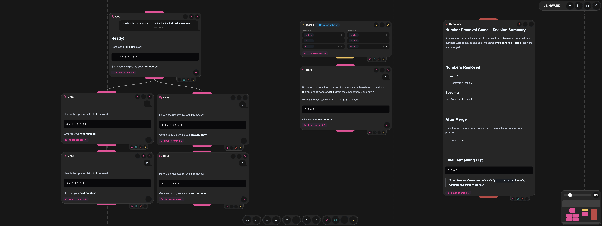

# Leinwand

LLM chat is linear — every message shares the same context, which gets polluted fast.
Leinwand gives you a node canvas where each node only sees the context of its
connected ancestors, giving you fine-grained control over what each LLM interaction
knows about.



## Node Types

**Chat Node**
Standard LLM chat interaction. Only sees the context fed into it from connected nodes.
Branch freely without polluting your existing context.

**Note Node**
A simple text editor for notes and reference material. Connect it to other nodes to
inject additional information into the LLM context.

**Summary Node**
Generates a summary of the incoming context. Useful for getting a quick overview of
a branch or condensing context before passing it elsewhere.

**Merge Node**
Combines the context of multiple branches into one. Ideal for starting a new chat
that draws on the combined knowledge of separate branches. Optionally checks branches
for inconsistencies and guides you through resolving them before they pollute the context.

## Features

- Node canvas built with React Flow
- Each node only sees the context of its connected ancestors
- Multi-provider LLM support (OpenAI, Anthropic, Gemini)
- API keys are added in the settings — your keys, your control
- Set a global model or configure a different model per node type
- Switch models mid-conversation to compare outputs or continue with a different provider
- Available models are fetched automatically based on your API key
- Streaming responses via SSE
- JWT authentication
- Encrypted API key storage

## Tech Stack

**Frontend:** React, React Flow, Zustand, DaisyUI, Tailwind, Vite
**Backend:** FastAPI, SQLAlchemy, LangChain, PostgreSQL, LangFuse (optional)

## Getting Started

### Prerequisites
- Node.js
- Python 3.14+
- A PostgreSQL database (free tier at [supabase.com](https://supabase.com/) works great)

### Backend

```bash
cd backend
pip install -r requirements.txt
cp .env.example .env  # fill in your database credentials and other keys
make dev
```

### Frontend

```bash
cd frontend
npm install
npm run dev
```

## Environment Variables

Copy `backend/.env.example` to `backend/.env` and fill in the required fields.

**Database** (required)
```env
DB_USER=""
DB_PASSWORD=""
DB_HOST=""
DB_PORT=""
DB_NAME=""
```

**Authentication** (required)
Generate a secret key with `openssl rand -hex 32` and a dummy hash with `openssl rand -hex 16`:
```env
AUTH_SECRET_KEY=""
AUTH_ALGORITHM=HS256
AUTH_ACCESS_TOKEN_EXPIRE_MINUTES=30
AUTH_DUMMY_HASH=""
```

**API Key Encryption** (required)
Generate an encryption key with `python -c "from cryptography.fernet import Fernet; print(Fernet.generate_key().decode())"`:
```env
ENCRYPTION_KEY=""
```

**Langfuse** (optional — leave empty to disable tracing)
```env
LANGFUSE_SECRET_KEY=""
LANGFUSE_PUBLIC_KEY=""
LANGFUSE_BASE_URL=""
```